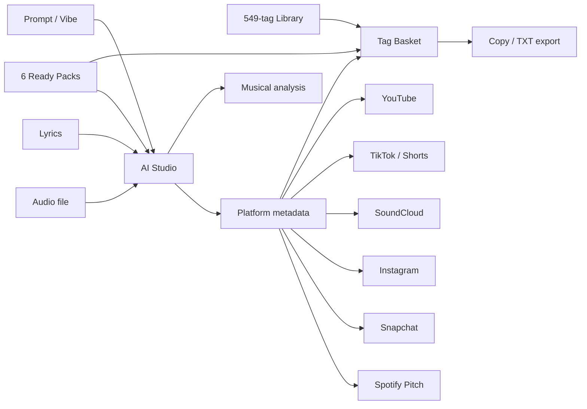
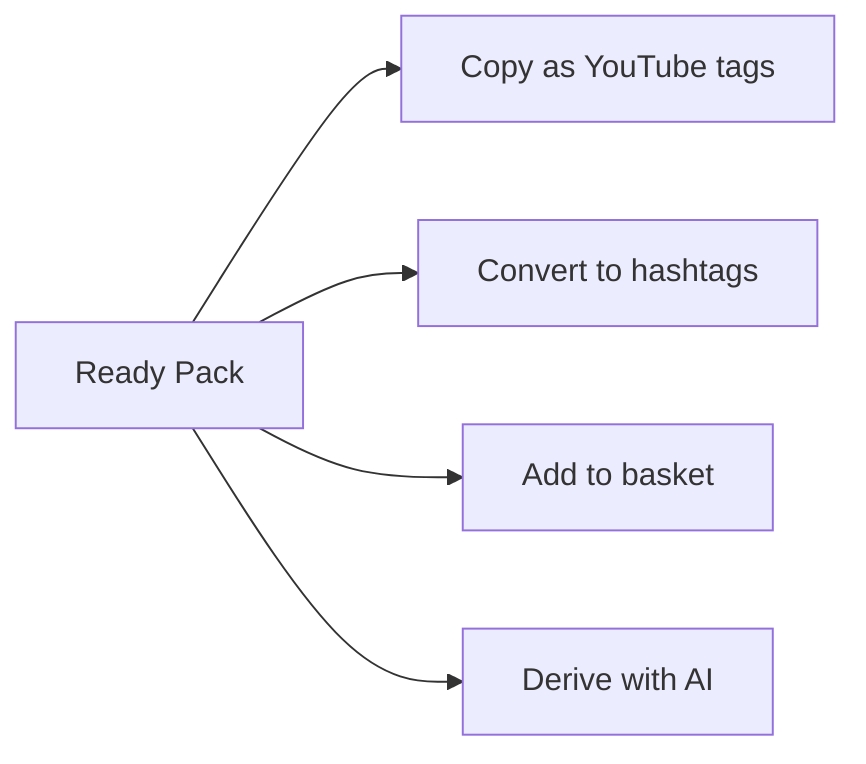
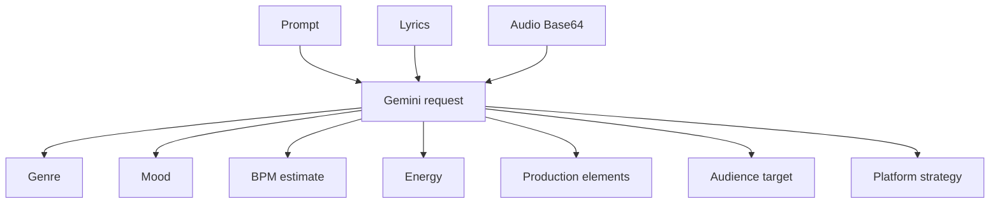
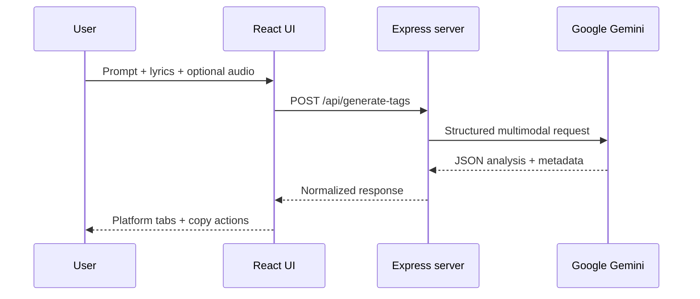
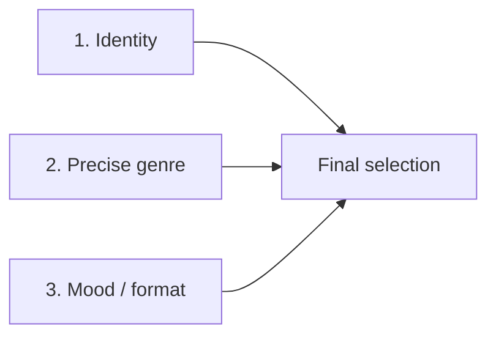
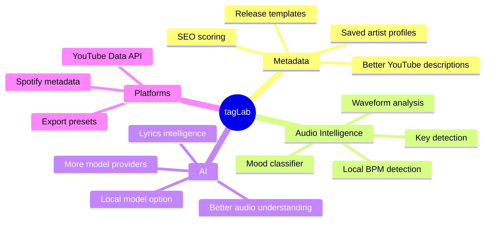

<div align="center">

# 🧪 tagLab

### Music SEO, Tag Library & Multimodal AI Toolkit

**549 curated tags · 6 ready-to-use packs · Gemini audio/lyrics analysis · YouTube / TikTok / SoundCloud / Instagram / Snapchat / Spotify outputs**

[](https://github.com/DissidentAI/tagLab-/stargazers)
[](https://github.com/DissidentAI/tagLab-/forks)
[](https://github.com/DissidentAI/tagLab-/issues)
[](https://react.dev/)
[](https://www.typescriptlang.org/)
[](https://vite.dev/)
[](https://expressjs.com/)
[](https://ai.google.dev/)

**Built for French rap, plug, pluggnb, trap, cloud rap, rage, hyperpop, drill and underground artists.**

</div>

---

## What is tagLab?

**tagLab** is a full-stack music metadata workspace for artists and independent creators.

Instead of treating tags as a static text file, tagLab combines four workflows in one interface:

1. **A curated library of 549 music tags** grouped by genre, mood, production style, format and search intent.
2. **Six pre-built tag packs** designed around common rap / plug release profiles.
3. **A tag basket** that lets you mix, format, measure, copy and export your final selection.
4. **A server-side multimodal AI studio** that can analyze a prompt, lyrics and an uploaded audio file, then generate platform-specific metadata.

The app is particularly focused on **French rap and new-wave / underground scenes**, while still producing English and international metadata where relevant.

---

## Application overview



---

# Features

## 1. 549-tag Master Library

The library contains **549 unique tags** with dedicated categories for:

- Artist / track identity
- French rap
- Plug
- PluggnB / R&B Plug
- Trap
- Cloud rap / atmospheric rap
- Rage / Hyperpop / Digital
- Drill / Dark
- Underground / New Wave
- Melodic / Emotional / Love
- Vibe / Ambience
- Video formats / Discovery
- Long-tail SEO queries
- Shorts / snippets / teasers
- Production / sonic characteristics
- French / francophone audience targeting

Example tags:

```text
plug français
pluggnb france
rap underground
cloud rap français
dark plug
melodic trap
night drive rap
new wave rap
french plug
music visualizer
rap shorts
```

### Library controls

You can:

- Search across all 549 tags
- Filter the library by category
- Copy one tag
- Copy one complete category
- Copy the entire library
- Add one tag to the basket
- Add a complete category to the basket
- Add the entire library to the basket
- See the current basket count from the library

### Dynamic artist & track placeholders

The navigation bar contains global fields for:

```text
Artist name
Track title
```

Placeholder tags such as:

```text
[TON NOM D'ARTISTE] plug
[NOM DU MORCEAU] official audio
```

are automatically converted to the current artist and track name before copying or exporting.

---

## 2. Six ready-to-use packs

The repository currently ships with these six packs:

| Pack | Intended use |
|---|---|
| **PLUG FR / UNDERGROUND** | Plug, digital synths, light 808s, underground / new-wave identity |
| **PLUGGNB / MELODIQUE** | Melodic autotune, nocturnal R&B, emotional / romantic PluggnB |
| **DARK PLUG / TRAP** | Dark production, heavy 808s, aggressive or nocturnal trap |
| **CLOUD / NIGHT DRIVE** | Atmospheric synths, dreamy rap and night-drive aesthetics |
| **RAGE / HYPERPOP** | Saturated synths, hypertrap, glitch and high-energy new-gen sounds |
| **SHORT / TEASER** | YouTube Shorts, snippets, previews and vertical release teasers |

Each pack:

- Includes artist and track placeholders
- Displays its current character count against YouTube's 500-character tag field limit
- Can be copied directly for YouTube
- Can be converted into hashtags
- Can be added to the basket
- Can be sent to the AI Studio as a starting vibe



---

## 3. Tag Basket & Export

The basket is the final assembly area for tags collected from the library, packs or AI results.

It includes a live **YouTube 500-character gauge** and warns when a comma-separated selection exceeds the limit.

### Output formats

The current basket supports four export formats:

| Format | Example |
|---|---|
| **YouTube / commas** | `plug, rap français, dark plug` |
| **Hashtags** | `#plug #rapfrançais #darkplug` |
| **One per line** | One tag per line |
| **Quoted** | `"plug", "rap français"` |

You can also:

- Remove individual tags
- Clear the entire basket
- Copy the final result to the clipboard
- Download the final selection as a `.txt` file
- Add a ready pack directly from the empty basket state

The exported TXT filename is generated from the current artist and track name.

---

# AI Studio

## Multimodal inputs

The AI Studio can combine **all three input types in a single request**:

### Prompt / vibe

Describe the sound in natural language.

```text
Pluggnb mélancolique, 808 glissante,
voix autotunée planante de nuit.
```

The UI also includes quick-vibe presets for:

- PluggnB
- Dark Trap
- Cloud Rap
- Rage / Hyperpop
- Melodic Drill
- New-generation French Plug

### Lyrics

Paste lyrics to give the model information about:

- Themes
- Vocabulary
- Emotional tone
- Artist identity
- Song subject

### Audio

Upload an audio file for multimodal analysis.

The client accepts browser-recognized audio MIME types and advertises:

```text
MP3 · WAV · M4A · OGG · FLAC
```

**Maximum file size: 25 MB.**

The selected audio is converted to Base64 in the browser and sent to the server as part of the `/api/generate-tags` request. The interface includes a local audio player so the file can be previewed before generation.

> Audio analysis is performed by the configured Gemini model when the audio is submitted. tagLab does not currently implement a standalone Web Audio API BPM/RMS analyzer.

---

## AI analysis output

The structured AI response can include:

- Detected sub-genre
- Detected mood
- BPM estimate
- Energy level
- Key production / sonic elements
- Audience target
- Recommended packs
- Track-specific SEO / release advice



---

# Platform-specific generation

The AI endpoint returns a structured metadata strategy for multiple platforms.

## YouTube SEO

Generated output includes:

- YouTube tag array
- Comma-separated ready-to-paste tag string
- Character count
- Three SEO-oriented title ideas
- Description snippet

The server prompt explicitly asks Gemini to keep YouTube tags below **480 characters** to leave margin below YouTube's 500-character field limit.

## TikTok / Shorts

Generated output includes:

- Short hashtag set
- Caption idea
- Hook / on-screen text idea

## SoundCloud

Generated output includes:

- Primary genre tag
- Secondary tags
- SoundCloud-formatted tag string

## Instagram / Reels

Generated output includes:

- Hashtag selection
- Reel caption idea

## Snapchat Spotlight

Generated output includes:

- Spotlight tags
- Topic keywords

## Spotify Pitch

Generated output can include:

- Mood keywords
- Style / genre keywords
- Short curator-facing pitch note

---

# AI architecture

The Gemini API key is kept **server-side**.

The browser never needs to contain a hard-coded Gemini secret.



The server uses `@google/genai` and reads:

```text
GEMINI_API_KEY
```

from the environment.

---

## Model fallback strategy

The current server attempts models in this order:

```text
1. gemini-2.5-flash
2. gemini-3.7-flash
3. heuristic-fallback
```

If remote model calls fail — for example because of temporary rate limiting, model overload or connectivity issues — tagLab falls back to an internal heuristic generator instead of returning an unusable screen.

The heuristic engine currently recognizes several broad sonic directions from prompt / lyric keywords, including:

- Rage / Hyperpop Trap
- Dark Drill / Trap Sombre
- Cloud Rap / Ambient 808
- French Plug / PluggnB

It then produces fallback metadata for YouTube, TikTok, SoundCloud, Instagram, Snapchat and Spotify pitch.

---

# SEO guide built into the app

A dedicated SEO screen explains the app's **three-layer tag strategy**:



### Layer 1 — Identity

Artist name, exact track title and release-format variants.

### Layer 2 — Precise genre

Examples: French Plug, PluggnB, Dark Trap, Cloud Rap, Rage, Drill.

### Layer 3 — Mood / production / format

Examples: night drive, melodic, 808, autotune, visualizer, official audio, lyrics.

The guide also reminds users that tags are only one metadata signal and that title, thumbnail, content quality and retention remain more important for performance.

---

# Tech stack

| Layer | Technology |
|---|---|
| Frontend | React 19 |
| Language | TypeScript 5.8 |
| Build tool | Vite 6 |
| Styling | Tailwind CSS 4 via `@tailwindcss/vite` |
| Icons | Lucide React |
| Motion | Motion / `motion` |
| Backend | Express 4 |
| AI SDK | `@google/genai` |
| Environment | dotenv |
| Dev runtime | `tsx` |
| Production server bundle | esbuild |

---

# Repository structure

```text
tagLab-/
├── .env.example
├── .gitignore
├── README.md
├── index.html
├── metadata.json
├── package.json
├── server.ts
├── tsconfig.json
├── vite.config.ts
├── assets/
└── src/
    ├── App.tsx
    ├── main.tsx
    ├── index.css
    ├── types.ts
    ├── data/
    │   └── masterTags.ts
    └── components/
        ├── AiStudioView.tsx
        ├── MasterTagsView.tsx
        ├── Navbar.tsx
        ├── PacksView.tsx
        ├── SeoGuideView.tsx
        ├── TagBasketDrawer.tsx
        └── Toast.tsx
```

---

# Installation

## Requirements

- Node.js
- npm
- A Gemini API key for AI generation

The tag library, packs, basket and SEO guide can be browsed without a successful Gemini request, but AI generation requires a server-side API key unless the request falls back to the heuristic engine after an attempted model call.

## 1. Clone the repository

```bash
git clone https://github.com/DissidentAI/tagLab-.git
cd tagLab-
```

## 2. Install dependencies

```bash
npm install
```

## 3. Configure environment variables

Copy the example file:

```bash
cp .env.example .env
```

On Windows CMD:

```cmd
copy .env.example .env
```

Then configure:

```env
GEMINI_API_KEY="your_gemini_api_key"
APP_URL="http://localhost:3000"
```

`GEMINI_API_KEY` is required for Gemini API calls.

## 4. Start development mode

```bash
npm run dev
```

The Express / Vite development server listens on:

```text
http://localhost:3000
```

## 5. Production build

```bash
npm run build
npm start
```

The build command:

1. Builds the React frontend with Vite.
2. Bundles `server.ts` into `dist/server.cjs` with esbuild.
3. Serves the generated `dist` frontend through Express in production.

## Type check

```bash
npm run lint
```

The current `lint` script runs:

```text
tsc --noEmit
```

---

# HTTP API

## Health check

```http
GET /api/health
```

Example response:

```json
{
  "status": "ok",
  "timestamp": "2026-08-24T17:00:00.000Z"
}
```

## Generate tags / analyze track

```http
POST /api/generate-tags
Content-Type: application/json
```

Accepted request fields:

```json
{
  "prompt": "Dark nocturnal French plug track",
  "artistName": "Artist",
  "trackName": "Track",
  "lyrics": "...",
  "audioBase64": "data:audio/mpeg;base64,...",
  "audioMimeType": "audio/mpeg",
  "targetVibe": "optional vibe",
  "selectedPlatforms": [
    "youtube",
    "soundcloud",
    "tiktok",
    "instagram",
    "snapchat",
    "spotifyPitch"
  ]
}
```

The Express JSON and URL-encoded payload limits are currently configured to **40 MB**.

---

# Privacy & security

## API key

The Gemini secret is read from the backend environment:

```env
GEMINI_API_KEY=...
```

Do not commit `.env` or hard-code a production key in React code.

## Audio handling

When you upload a track:

1. The browser creates a local object URL for playback.
2. The browser converts the file to Base64.
3. The Base64 audio is sent to the tagLab Express backend when you launch AI generation.
4. The backend forwards the audio inline to Gemini as part of the multimodal request.

Therefore, **audio uploaded for AI analysis is not purely local**. It is transmitted to the configured Google Gemini service when AI analysis succeeds.

Consult the API provider's current data-processing terms before using sensitive or unreleased material.

---

# Current limitations

- AI generation currently targets **Google Gemini**, not arbitrary AI providers.
- The UI accepts audio up to **25 MB**.
- Audio is Base64-encoded, which increases request size before it reaches the server's 40 MB JSON limit.
- BPM is an **AI estimate**, not a deterministic local DSP measurement.
- There is currently no local key detection or waveform-analysis engine.
- The heuristic fallback is intentionally broader and less track-specific than Gemini multimodal analysis.
- The 549-tag library is focused heavily on rap / plug / new-wave music rather than every music genre.

---

# Roadmap



Potential next steps:

- [ ] Deterministic local BPM detection
- [ ] Musical key detection
- [ ] Waveform / spectral analysis
- [ ] YouTube Data API integration
- [ ] Saved artist profiles
- [ ] Release presets
- [ ] Multi-provider AI support
- [ ] Local AI model support
- [ ] More genres outside the rap / plug ecosystem
- [ ] Automated SEO score based on the final metadata bundle

---

# Contributing

Contributions, bug reports and feature requests are welcome.

```bash
git checkout -b feature/my-feature
git add .
git commit -m "Add my feature"
git push origin feature/my-feature
```

Then open a Pull Request.

---

# GitHub Topics

Recommended repository topics:

```text
youtube-seo
youtube-tags
tag-generator
music-seo
music-tools
french-rap
plug
pluggnb
trap
cloud-rap
underground-rap
music-marketing
artist-tools
audio-analysis
multimodal-ai
gemini
react
typescript
vite
express
```

---

# Disclaimer

**tagLab is an independent project and is not affiliated with, endorsed by or sponsored by YouTube, Google, TikTok, SoundCloud, Instagram, Snapchat or Spotify.**

Metadata optimization can improve consistency, discoverability and contextual signals, but no set of tags, hashtags or AI-generated metadata can guarantee views, recommendations, rankings or viral performance.

---

<div align="center">

## Support tagLab

If the project is useful, a GitHub star helps other artists and developers discover it.

[](https://github.com/DissidentAI/tagLab-/stargazers)

**Build a cleaner metadata workflow · Understand your track · Publish faster**

[⭐ Star](https://github.com/DissidentAI/tagLab-/stargazers) · [🐛 Issues](https://github.com/DissidentAI/tagLab-/issues) · [🍴 Fork](https://github.com/DissidentAI/tagLab-/fork)

</div>
