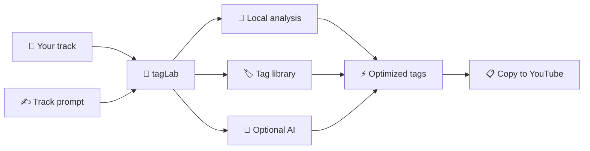
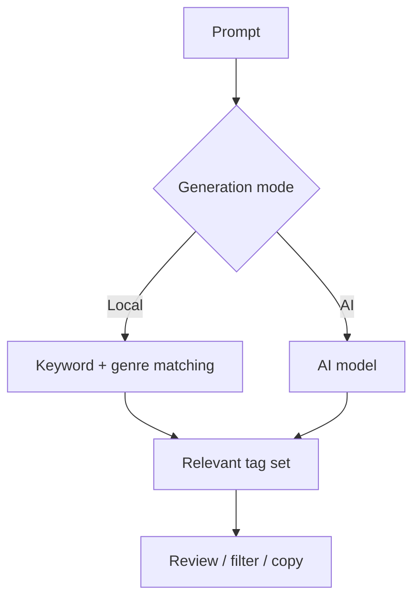
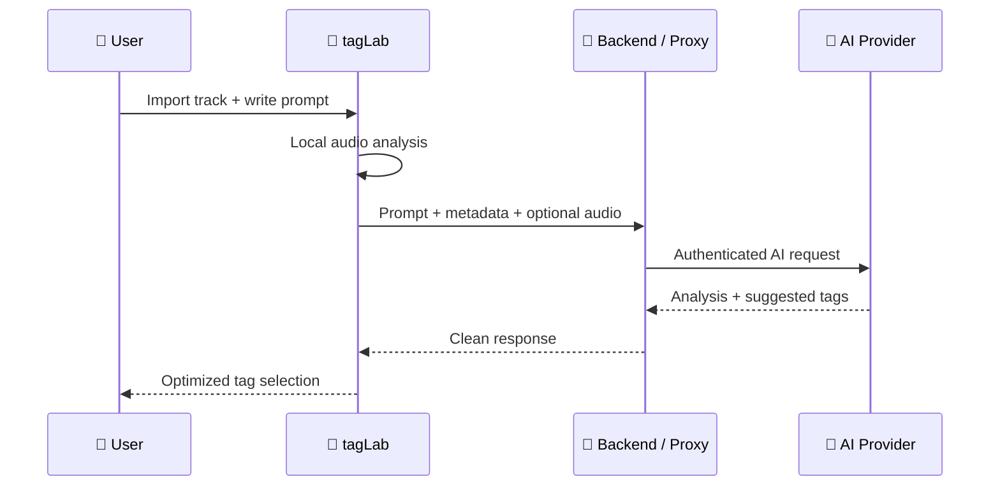
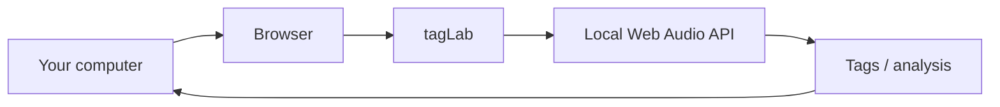
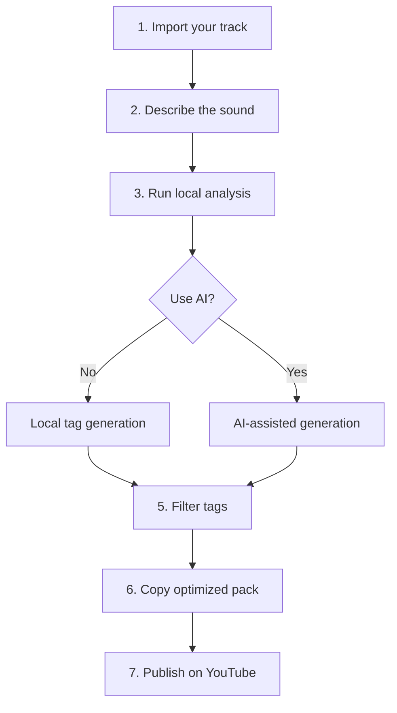
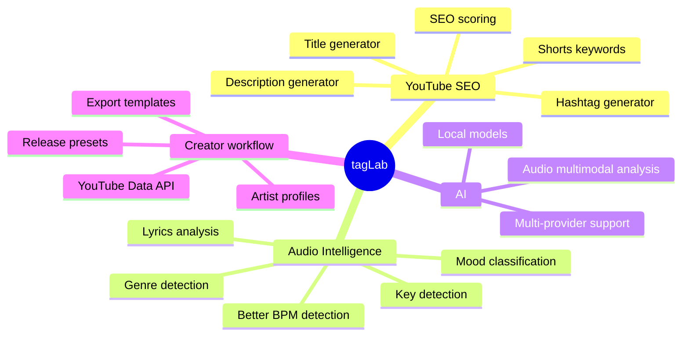

<div align="center">

# 🧪 tagLab

### YouTube Tag Generator & Music SEO Toolkit

Generate smarter metadata for **rap, plug, pluggnb, trap, cloud rap, rage, hyperpop, drill and underground music**.

[](https://github.com/DissidentAI/tagLab-/stargazers)
[](https://github.com/DissidentAI/tagLab-/forks)
[](https://github.com/DissidentAI/tagLab-/issues)


**500+ built-in tags · Prompt generation · Optional AI · Audio analysis · One-click copy**

</div>

---

## ✨ What is tagLab?

**tagLab** is a lightweight, standalone web application for artists, producers and content creators who want to generate, organize and optimize YouTube metadata for music releases.

It is designed especially for:

- French rap
- Plug / PluggnB
- Trap
- Cloud rap
- Rage
- Hyperpop
- Drill
- Underground / New Wave
- Melodic / emotional rap
- Dark / atmospheric music

The core application works **locally in your browser** and does **not require an account, backend, framework or AI API**.

---

## 🖼️ How tagLab works



---

## 🚀 Main features

### 🏷️ 500+ built-in music tags

A large built-in tag library covering genres, moods, formats and search intents.

```text
plug
plug français
pluggnb
rap underground
cloud rap français
dark plug
melodic trap
new wave rap
french plug
music visualizer
rap shorts
...
```

You can:

- Search tags instantly
- Filter by category
- Select individual tags
- Copy all tags
- Copy only your selection
- Build compact tag packs
- Reuse presets depending on the track

---

## 🧠 Prompt-based tag generation

Describe your song in natural language:

```text
Dark French pluggnb track with atmospheric synths,
melodic autotune vocals, heavy 808s and a late-night mood.
```

Then tagLab generates a relevant set of tags around the description.



The local generator works without any API.

---

## 🎧 Audio import & analysis

Import an audio file directly into tagLab.

Common browser-supported formats include:

- MP3
- WAV
- M4A / AAC
- OGG
- FLAC

The app contains a built-in audio player and can inspect several properties directly in the browser.

### Local audio metrics

| Metric | Purpose |
|---|---|
| Duration | Track length |
| Approx. BPM | Tempo estimation |
| RMS | Average energy |
| Peak level | Maximum amplitude |
| Sample rate | Audio resolution information |
| Channels | Mono / stereo detection |
| Zero-crossing rate | Rough spectral / texture indicator |

---

## 🤖 Optional AI integration

AI is completely optional.

You can configure:

```text
API endpoint
AI model
API key
Optional audio-analysis endpoint
```

### Architecture



> [!IMPORTANT]
> Do not expose a production API key in a publicly hosted HTML/JavaScript application. Use a backend or secure proxy for public deployments.

---

## 🔐 Privacy-first local workflow

Without AI enabled:



Your audio does not need to leave the browser for the local features.

When you explicitly configure and use an external AI endpoint, the privacy and data-processing rules of that provider apply.

---

## ⚡ Quick start

### Download

Clone the repository:

```bash
git clone https://github.com/DissidentAI/tagLab-.git
cd tagLab-
```

Then open the HTML application in a modern browser.

### Optional local server

For better compatibility with browser APIs:

```bash
python -m http.server 8080
```

Then open:

```text
http://localhost:8080
```

No `npm install` required.

---

## 🎯 Recommended workflow



A useful final tag set combines several layers:

```text
Artist identity
+
Track title
+
Main genre
+
Subgenre
+
Mood
+
Production style
+
Language / market
+
Video format
```

Example:

```text
artist name,
track title,
plug,
plug français,
pluggnb,
rap français,
rap underground,
dark plug,
melodic plug,
cloud rap,
new wave rap,
french plug,
official audio,
music visualizer
```

---

## 🛠️ Technology

<div align="center">

| Layer | Technology |
|---|---|
| Structure | HTML5 |
| UI | CSS3 |
| Logic | Vanilla JavaScript |
| Audio | Web Audio API |
| Files | File API |
| Network | Fetch API |
| Processing | Browser-side |

</div>

The project intentionally avoids unnecessary dependencies.

---

## 📦 Suggested project structure

```text
tagLab-/
├── tagLab.html
├── README.md
├── LICENSE
└── assets/
```

The application can also remain entirely contained in a single HTML file.

---

## 🗺️ Roadmap



### Planned ideas

- [ ] YouTube title generator
- [ ] YouTube description generator
- [ ] Hashtag generator
- [ ] Shorts keyword generator
- [ ] SEO score
- [ ] Thumbnail concept generator
- [ ] Improved BPM detection
- [ ] Key detection
- [ ] Automatic genre detection
- [ ] Mood classification
- [ ] Lyrics analysis
- [ ] YouTube Data API integration
- [ ] Spotify metadata integration
- [ ] Saved artist profiles
- [ ] Release templates
- [ ] Multi-provider AI support
- [ ] Local AI model support

---

## ⭐ Support the project

If tagLab is useful to you, **leave a star** — it helps the project become more visible and makes it easier for other artists and creators to discover it.

<div align="center">

[](https://github.com/DissidentAI/tagLab-/stargazers)

</div>

---

## 🤝 Contributing

Contributions, bug reports and feature requests are welcome.

```bash
git checkout -b feature/my-feature
git commit -m "Add my feature"
git push origin feature/my-feature
```

Then open a Pull Request.

---

## 🏷️ GitHub Topics

```text
youtube-seo
youtube-tags
tag-generator
music-seo
music-tools
youtube-tools
rap
french-rap
plug
pluggnb
trap
cloud-rap
underground-rap
music-marketing
artist-tools
audio-analysis
ai-tools
javascript
html
web-app
open-source
```

---

## ⚠️ Disclaimer

tagLab is an independent project and is not affiliated with, endorsed by or sponsored by YouTube or Google.

Metadata optimization can improve organization and contextual signals, but no tag strategy can guarantee views, recommendations, rankings or viral performance.

---

<div align="center">

## 🧪 tagLab

**Generate smarter tags · Understand your track · Publish faster**

[⭐ Star](https://github.com/DissidentAI/tagLab-/stargazers) · [🐛 Issues](https://github.com/DissidentAI/tagLab-/issues) · [🍴 Fork](https://github.com/DissidentAI/tagLab-/fork)

</div>
